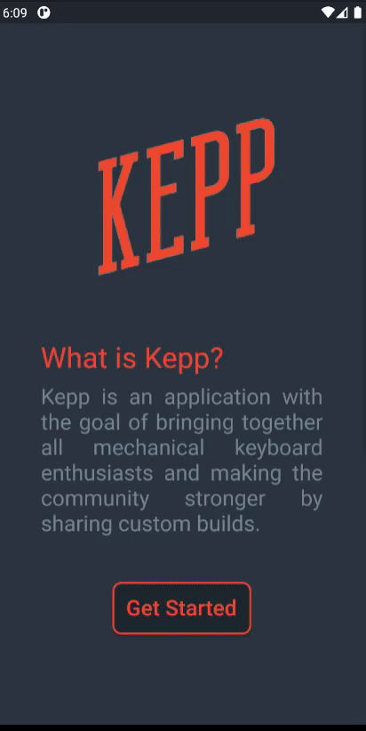

# kepp

Um aplicativo para entusiastas de teclados mecânicos. Recomendação e desenvolvimento de builds personalizadas com o apoio da comunidade.

# roles

- documentação [Maite Rafaelli](https://github.com/maracaren)
- front-end [Julio Bonon](https://github.com/juliobonon)
- back-end [Vitor Gabriel de Oliveira](https://github.com/VitorGabrieldeOliveira)
- UI/UX [Luan Alexandre Sarri](https://github.com/LuanSarri)
- database [Marilia Cancelli Alves](https://github.com/cncll)

